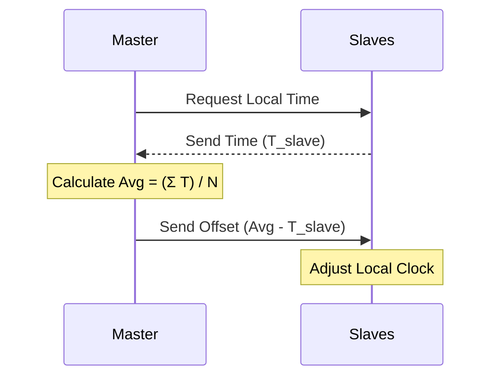
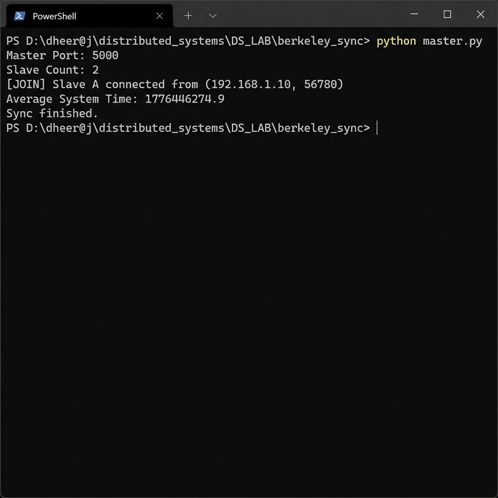

# ⏳ Experiment 08: Berkeley Clock Synchronization
### **Aim**: Berkeley Clock Synchronization Algorithm.
### **Result**: Successfully implemented and executed the Berkeley Clock Synchronization algorithm.
---
## How it Works
A centralized algorithm for synchronizing clocks in a network.
1. **Master** polls all **Slaves** for their current time.
2. Slaves respond with local times.
3. Master calculates the **average** of all times (including its own).
4. Master sends an **Adjustment Offset** to each slave to align them.
### Flowchart

## Setup
1. Run `master.py` and specify the number of slaves.
2. Run `slave.py` on different machines.

