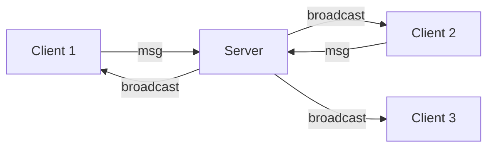
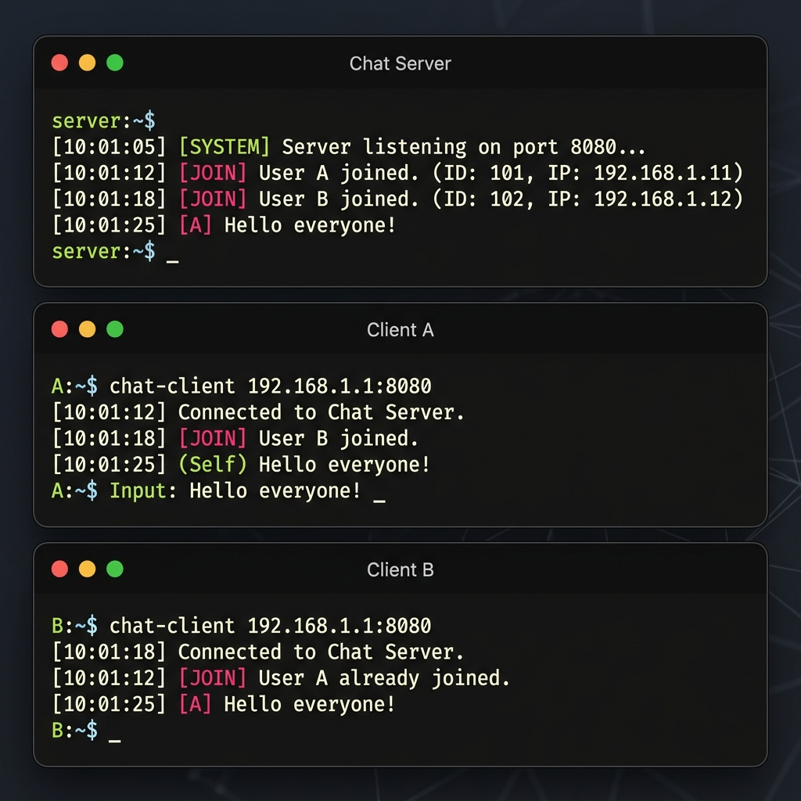

# 💬 Experiment 13: Distributed Chat Application
### **Aim**: Simple Distributed Chat Application using sockets.
### **Result**: Successfully implemented and executed the simple Distributed Chat Application using sockets.
---
## How it Works
A multi-client chat system using a central broadcasting server.
1. **Server** maintains a dictionary of connections.
2. When a client sends a message, the server forwards it to everyone except the sender.
### Flowchart

## Setup
1. Run `server.py` on the main host.
2. Run `client.py` on remote machines.

