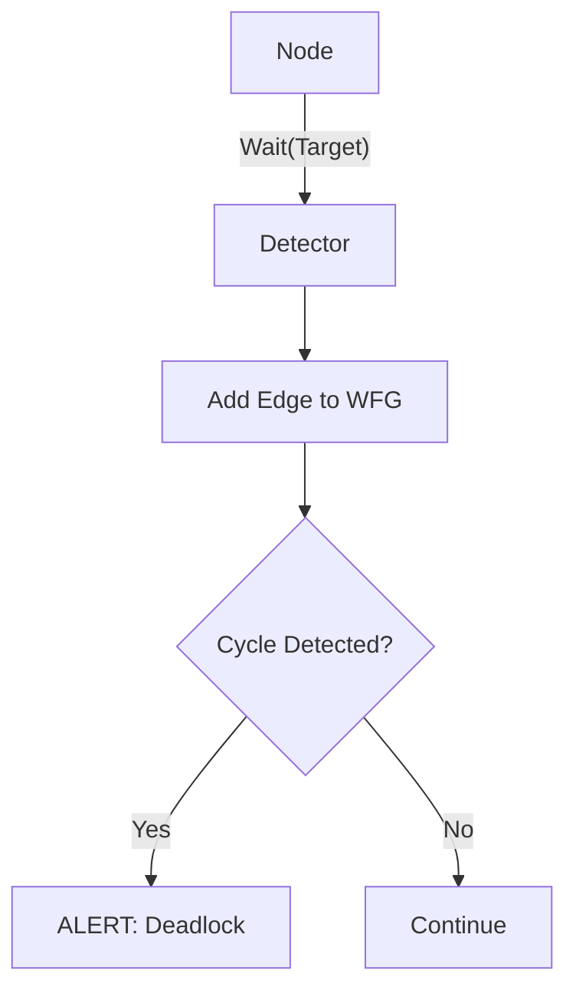
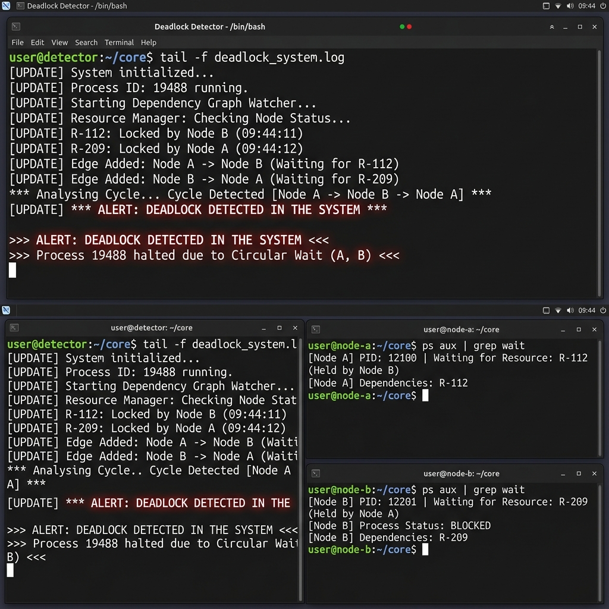

# 🚨 Experiment 16: Distributed Deadlock Detection
### **Aim**: Distributed Deadlock Detection (wait-for graph).
### **Result**: Successfully implemented and executed the Distributed Deadlock Detection (wait-for graph) program.
---
## How it Works
Implements the **Edge-Chasing** / **Wait-For-Graph (WFG)** algorithm.
1. Nodes notify a central **Detector** when waiting for another node.
2. The Detector runs a **Cycle Detection** (DFS) after every update.
3. If a cycle is found (e.g., `A -> B -> A`), a deadlock is declared.
### Flowchart

## Setup
1. Run `detector.py`.
2. Run `node.py` and define dependencies.

