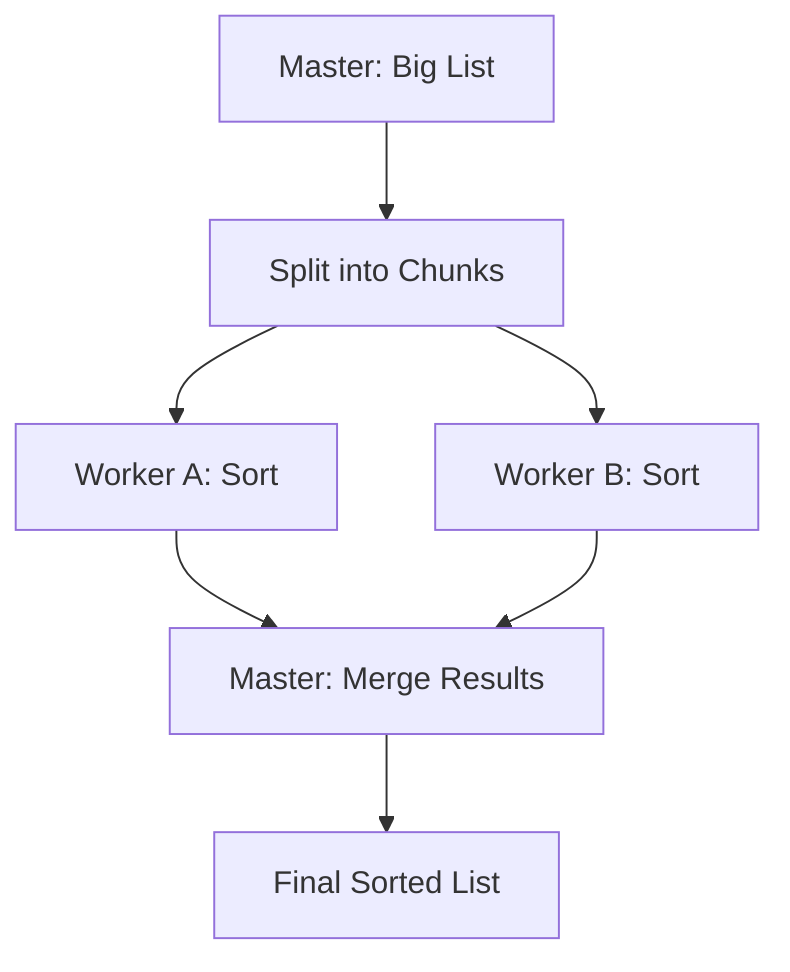
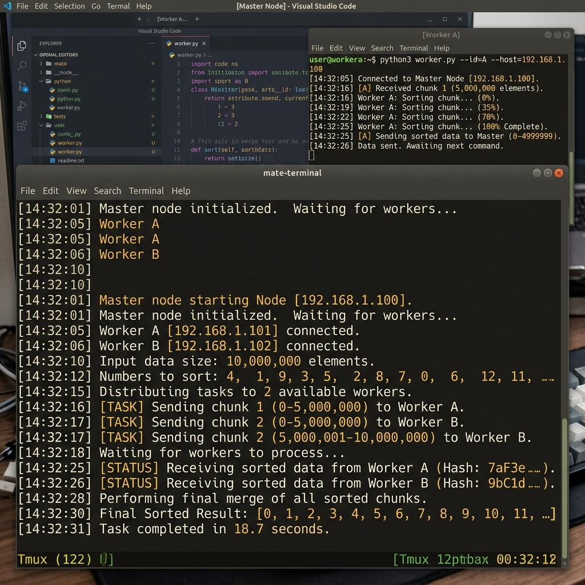

# 🔢 Experiment 19: Distributed Sorting
### **Aim**: Distributed Sorting (Merge Sort / Quick Sort) across nodes.
### **Result**: Successfully implemented and executed the Distributed Sorting across nodes.
---
## How it Works
1. **Master** splits a list into `N` equal chunks.
2. **Workers** sort chunks locally and send them back.
3. Master merges/sorts the results into the final list.
### Flowchart

## Setup
1. Run `master.py` and provide input numbers.
2. Run `worker.py` on remote machines.

