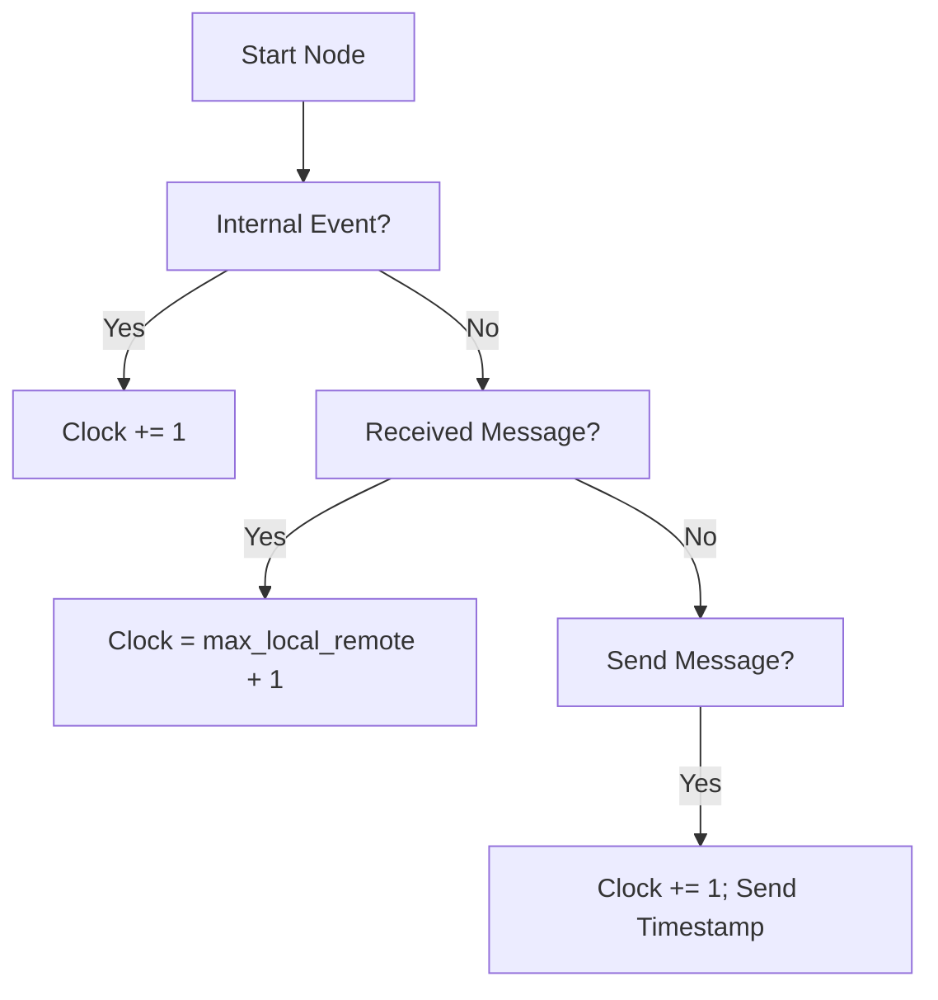
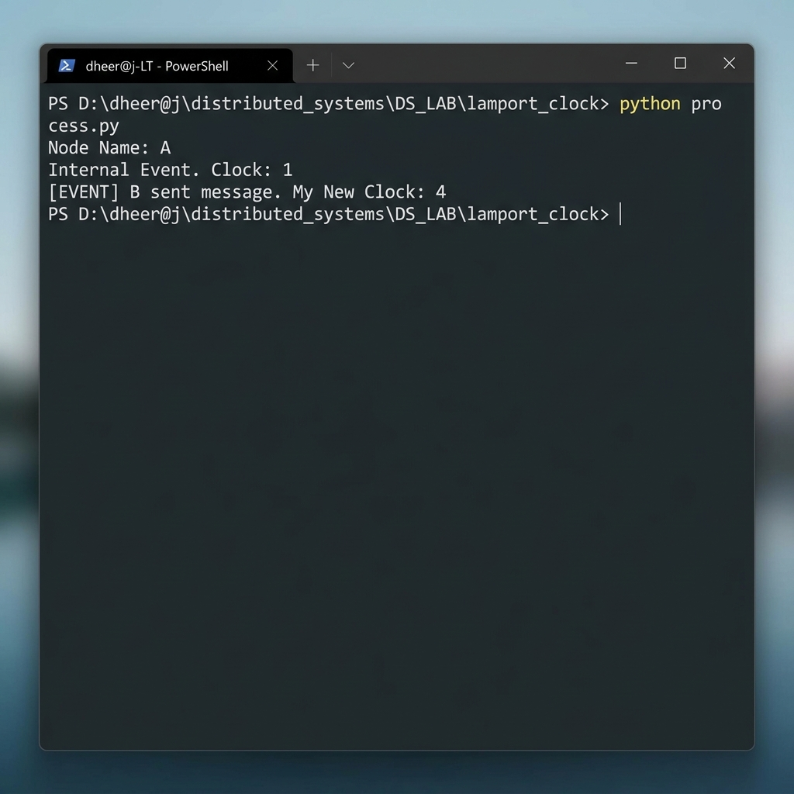

# ⏰ Experiment 04: Lamport Logical Clock
### **Aim**: Lamport Logical Clock Algorithm.
### **Result**: Successfully implemented and executed the Lamport Logical Clock algorithm.
---
## How it Works
Lamport's clock synchronizes event ordering in a distributed system where physical clocks might drift.
1. Each node maintains a local integer `clock`.
2. **Internal Event**: `clock = clock + 1`.
3. **Send Event**: `clock = clock + 1` and send timestamp with message.
4. **Receive Event**: `clock = max(local_clock, received_clock) + 1`.
### Flowchart

## Setup
1. Run `process.py` on multiple terminals.
2. Trigger events or send messages between nodes using IPs/Ports.

