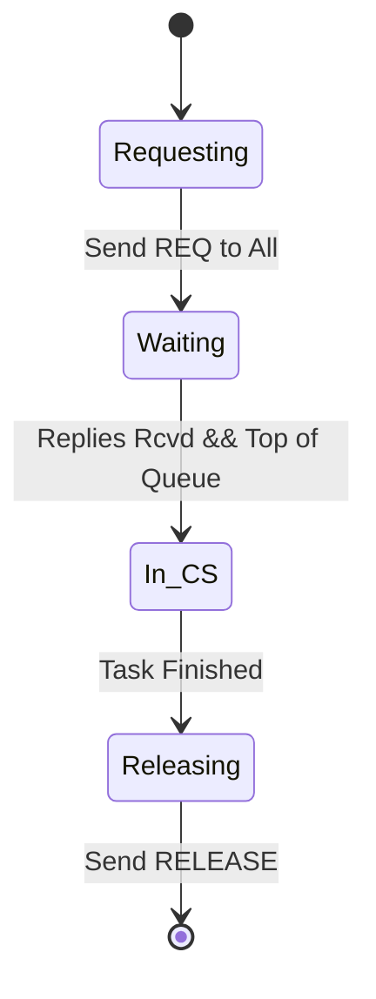
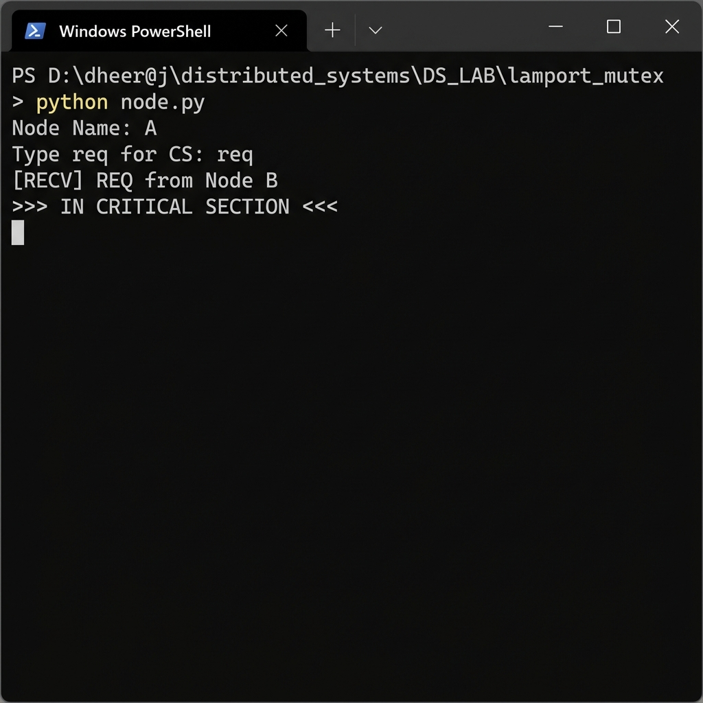

# 🛡️ Experiment 10: Lamport Mutual Exclusion
### **Aim**: Mutual Exclusion using Lamport’s Algorithm.
### **Result**: Successfully implemented and executed the Mutual Exclusion using Lamport’s algorithm.
---
## How it Works
A permission-based algorithm using Logical Clocks and shared request queues.
1. **Request**: Node sends `REQ(timestamp, ID)` to all others.
2. **Reply**: Other nodes send a `REPLY`.
3. **Enter CS**: Node enters CS if its request is at the top of the queue AND it has received replies from everyone.
4. **Release**: Node removes its request and sends `RELEASE` to everyone.
### Flowchart

## Setup
1. Run `node.py` with unique IDs (e.g., 0, 1, 2).
2. Type `req` to compete for the Critical Section.

