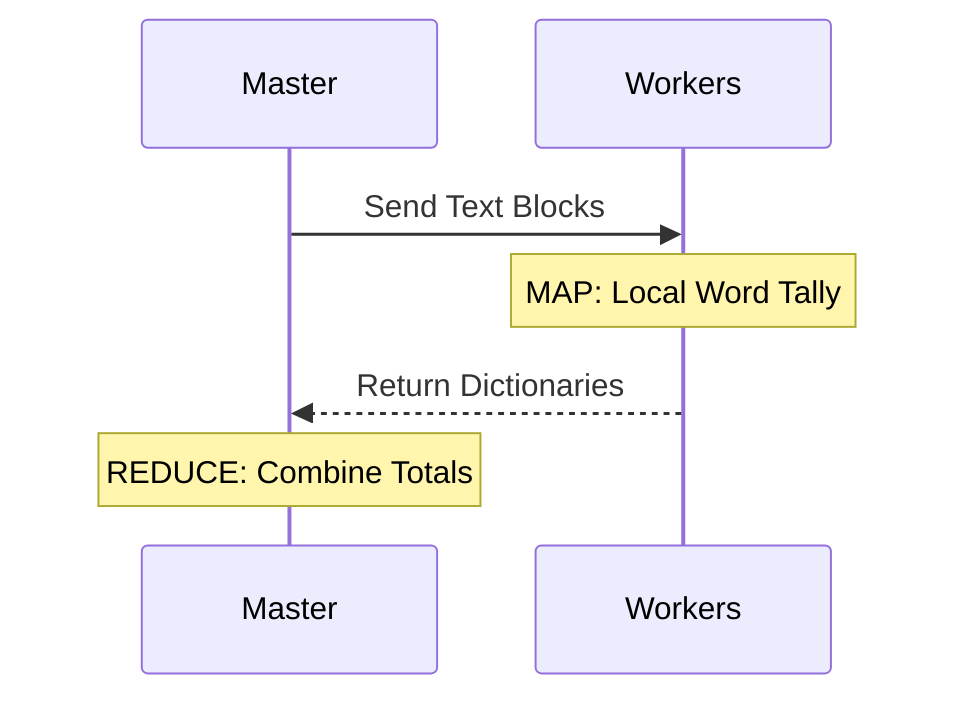
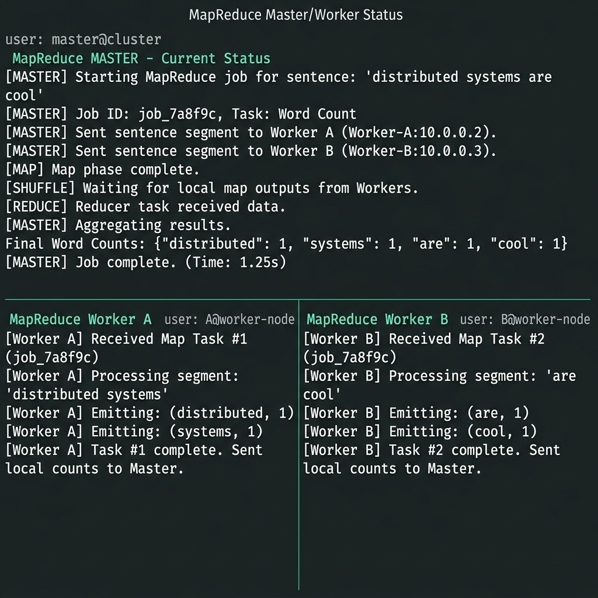

# 🗺️ Experiment 20: MapReduce Word Count
### **Aim**: MapReduce for Word Count.
### **Result**: Successfully implemented and executed the MapReduce simulation for Word Count.
---
## How it Works
1. **Split**: Master divides text into fragments.
2. **Map**: Workers count occurrences in their fragment.
3. **Reduce**: Master aggregates dictionaries into final total count.
### Flowchart

## Setup
1. Run `master.py` and enter text.
2. Connect workers to perform tasks.

