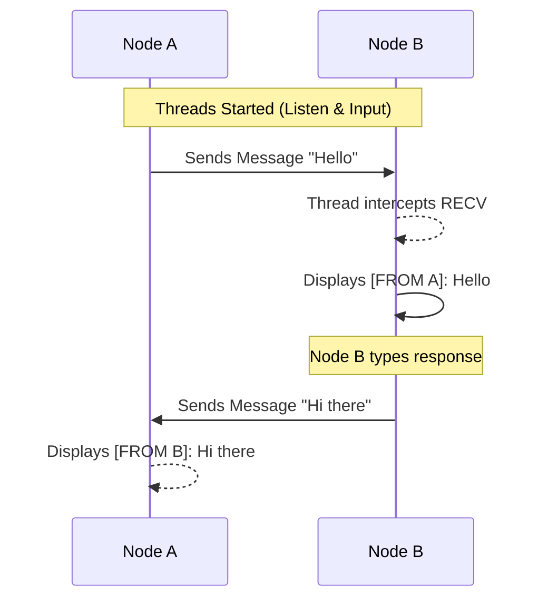
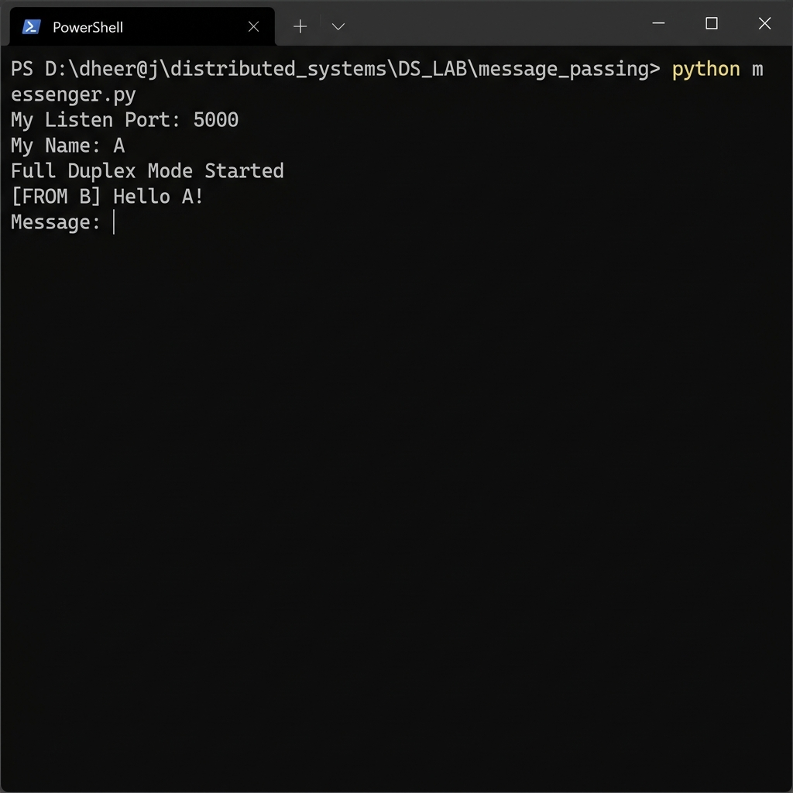

# 📩 Experiment 03: Message Passing
### **Aim**: Message Passing between two processes.
### **Result**: Successfully implemented and executed the Full-Duplex Message Passing program.
---
## How it Works
This program implements **Bi-directional communication** between two processes. Both nodes run a background listener thread, allowing either process to send a message at any time.
### Flowchart

## Setup
1. Run `messenger.py`.
2. Enter your name and listening port.
3. Enter the peer's IP and port. 
4. Type messages freely.

