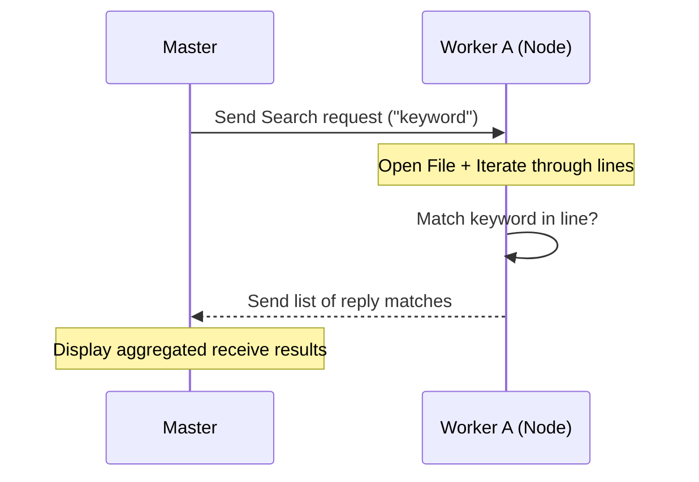

# 🔍 Experiment 22: Parallel File Search
### **Aim**: Develop a program for Parallel File Search across distributed nodes.
### **Result**: Successfully implemented and executed the Parallel File Search algorithm.
---
## How it Works
1. **Master** accepts a `request` (search keyword) from the user.
2. The `request` is broadcast to all active **Workers**.
3. Each worker opens a local file and iterates through every `line`.
4. If a match is found, the worker stores the `reply` (content of the line).
5. The Master will `receive` all replies and display them as a consolidated result list.
### Flowchart

## Setup
1. Run `master.py` and enter the keyword.
2. Run `worker.py` on nodes containing data.
