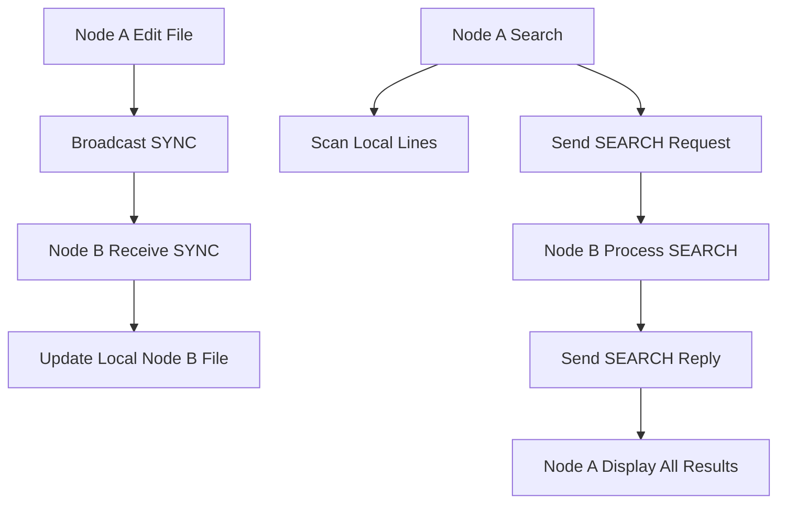

# 🔍 Experiment 22: Parallel Search & Sync
### **Aim**: Develop a program for Parallel File Search and Collaborative Synchronization across distributed nodes.
### **Result**: Successfully implemented and executed the P2P Parallel File Search & Sync algorithm.
---
## How it Works
This system implements a **Peer-to-Peer Distributed File System** with consistency.
1. **Synchronization**: When a node edits a file, it sends a `SYNC` `request` to all peers. The peers `receive` this update and overwrite their local copies, ensuring global state consistency.
2. **Parallel Search**: When a user inputs a keyword, the node scans every `line` of its local files and simultaneously sends a `SEARCH` `request` to all peers.
3. **Aggregation**: Peers process the search and send back a `reply` with matching lines. The originating node displays the consolidated results.
### Flowchart

## Setup
1. Run `node.py` on multiple terminals with unique ports (e.g. 8000, 8001).
2. Edit files on one node and observe automatic updates on others.
3. Perform a keyword search across the entire distributed network.
