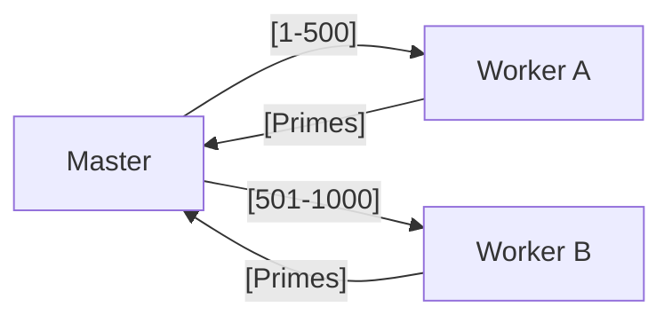
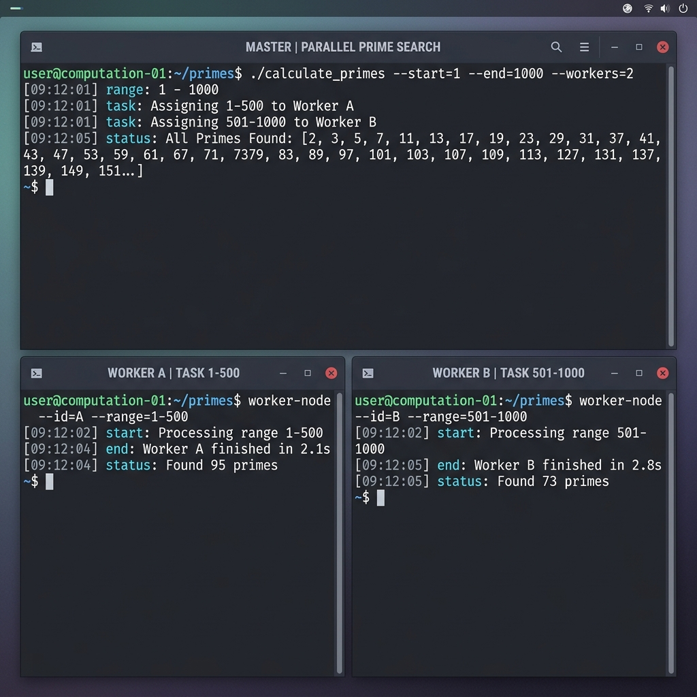

# 🔢 Experiment 21: Distributed Prime Calculation
### **Aim**: Distributed Prime Number Calculation (range split across nodes).
### **Result**: Successfully implemented and executed the Distributed Prime Number Calculation (range splitting).
---
## How it Works
Splits a heavy mathematical search range across multiple nodes.
1. **Master** defines a range (e.g., 1 to 1000).
2. Range is divided into equal sub-ranges.
3. **Workers** check for primality in their range.
4. Master aggregates all found primes.
### Flowchart

## Setup
1. Run `master.py` and set the range.
2. Connect workers to calculate.

