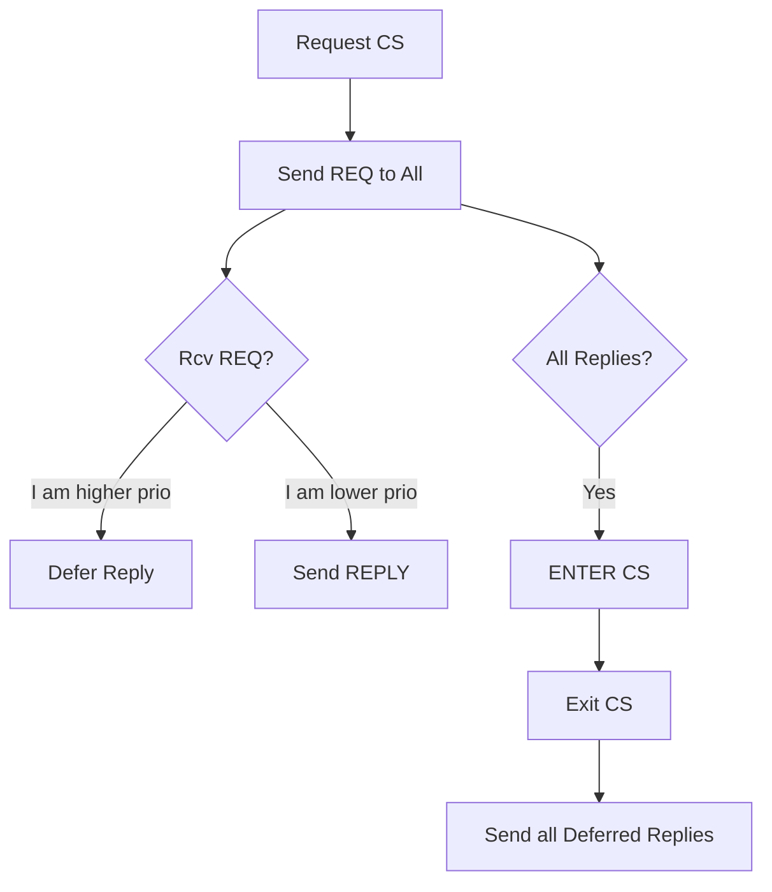
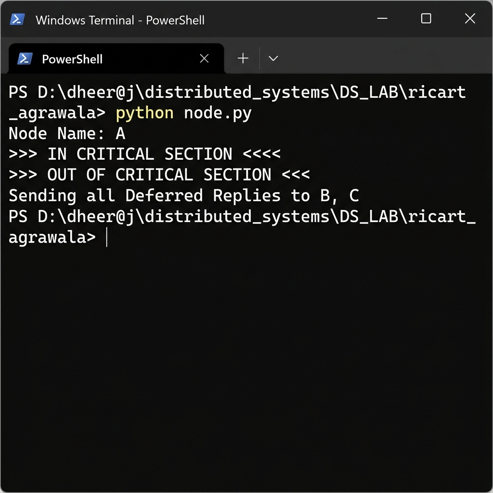

# ⚡ Experiment 11: Ricart-Agrawala Algorithm
### **Aim**: Ricart–Agrawala Algorithm for distributed mutual exclusion.
### **Result**: Successfully implemented and executed the Ricart–Agrawala algorithm for distributed mutual exclusion.
---
## How it Works
An optimized version of Lamport's Mutex that removes the `RELEASE` message.
1. Node sends `REQ(timestamp)` to all.
2. An incoming `REQ` is handling based on priority:
   - If receiver is in CS or has higher priority: **Defer Reply**.
   - Otherwise: Send **REPLY** immediately.
3. Node enters CS once it has **all replies**.
### Flowchart

## Setup
Run `node.py` on multiple terminals and use IDs to manage peer connections.

