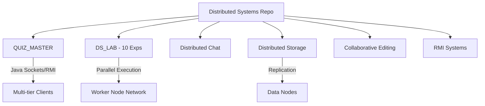

# 🪐 Distributed Systems Portfolio
-blueviolet?style=for-the-badge)

A comprehensive collection of distributed systems research, large-scale applications, and fundamental algorithms. This repository spans from low-level socket coordination to high-level multi-tier Java applications.

---

## 🏗️ Core Distributed Projects

| Project | Language | Description | Link |
| :--- | :---: | :--- | :---: |
| **QUIZ MASTER** | Java | A multi-tier, GUI-based distributed quiz application with Server-Client architecture. | [View Project](./QUIZ_MASTER) |
| **DS LAB** | Python | A collection of 10 core distributed algorithms refactored for modern network execution. | [View Project](./DS_LAB) |
| **Distributed Chat** | Python | A multi-room chat server implementation supporting concurrent users. | [View Project](./distributed_chat) |
| **Distributed Storage** | Python | Implementation of scalable storage nodes with data replication logic. | [View Project](./distributed_storage) |
| **Collaborative Editor** | Python | Real-time concurrent editing system using version vectors and conflict resolution. | [View Project](./collaborative_editing) |
| **RMI Systems** | Python | Remote Method Invocation (RMI) and simulate RPC simulations. | [View Project](./rmi_systems) |

---

## 🧪 The DS Lab (10 Experiments)
*A structured implementation of classic distributed algorithms refactored for modern network execution.*

| Exp | Module | Aim | Status |
| :--- | :--- | :--- | :---: |
| 03 | **Message Passing** | Bidirectional communication between two processes. | ✅ |
| 04 | **Lamport Clock** | Logical clock algorithm for event ordering. | ✅ |
| 08 | **Berkeley Sync** | Master-Slave clock synchronization. | ✅ |
| 10 | **Lamport Mutex** | Distributed Mutual Exclusion (Shared Queue). | ✅ |
| 11 | **Ricart-Agrawala** | Optimized Mutex (Deferred Replies). | ✅ |
| 13 | **Chat App** | simple Distributed Chat Application using sockets. | ✅ |
| 16 | **Deadlock Detect** | Distributed Deadlock Detection (Wait-for graph). | ✅ |
| 19 | **Dist. Sorting** | Merge Sort / Quick Sort across worker nodes. | ✅ |
| 20 | **MapReduce** | Data processing simulation for Word Count. | ✅ |
| 21 | **Prime Calc** | Calculation of primes across split ranges. | ✅ |

---

## 🛠️ Global Setup Notes

### **Network Configuration**
All internal projects and lab experiments are designed for **multi-machine execution**. 
- **Binding**: Masters/Servers bind to `0.0.0.0` to listen on all interfaces.
- **Connecting**: Clients/Workers use the host machine's LAN IP address (e.g., `192.168.x.x`).

---

## 📊 Technical Architecture

*Maintained by widgetwalker/Distributed_Storage*
