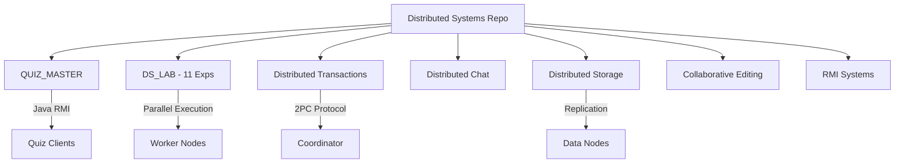

# Distributed Systems Research & Implementation

A comprehensive collection of distributed systems research, large-scale applications, and fundamental algorithms. This repository spans from low-level socket coordination to high-level multi-tier Java applications.

## 🏗️ Core Distributed Projects

### 1. [Distributed Transactions (2PC)](./transactions)
Implementation of the Two-Phase Commit protocol with a central coordinator and multiple data partitions. Includes an interactive client and standalone server.

### 2. [DS Lab (11 Experiments)](./DS_LAB)
A structured implementation of classic distributed algorithms refactored for modern network execution.
- **Lamport & Berkeley Sync**
- **Ricart-Agrawala & Lamport Mutex**
- **Distributed Sorting & MapReduce**
- **NEW: Clock Synchronization Averaging**

### 3. [Collaborative Editing](./collaborative_editing)
Shared document state management with synchronization logic.

### 4. [Distributed Chat](./distributed_chat)
Socket-based multi-user communication system.

### 5. [Distributed Storage](./distributed_storage)
Research and implementation of distributed data storage and replication.

### 6. [QUIZ_MASTER](./QUIZ_MASTER)
A multi-tier Java application using RMI for a distributed quiz system.

### 7. [RMI Systems](./rmi_systems)
A collection of Java Remote Method Invocation examples and arithmetic servers.

---

## 🧪 Network Configuration
All projects are designed for multi-machine execution.
- **Binding**: Servers typically bind to `0.0.0.0` to listen on all interfaces.
- **Connecting**: Clients should use the host machine's LAN IP address (e.g., `192.168.x.x`).

## 📊 Technical Architecture

## 🛠️ Requirements
- **Java**: JDK 21+
- **Python**: 3.8+
- **Git**: For version control

Maintained by **widgetwalker**.
